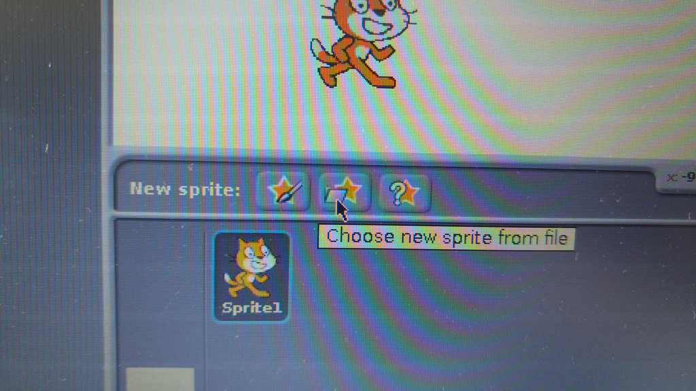
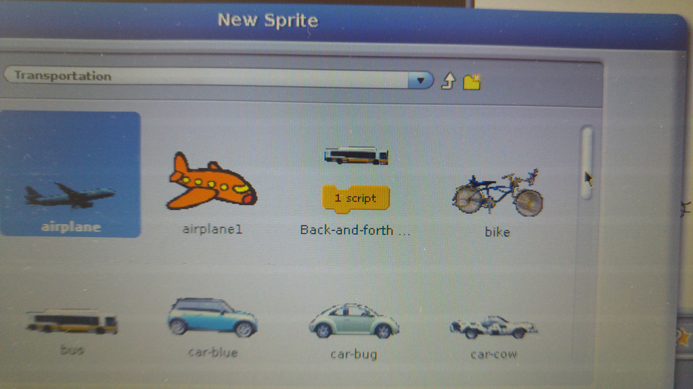
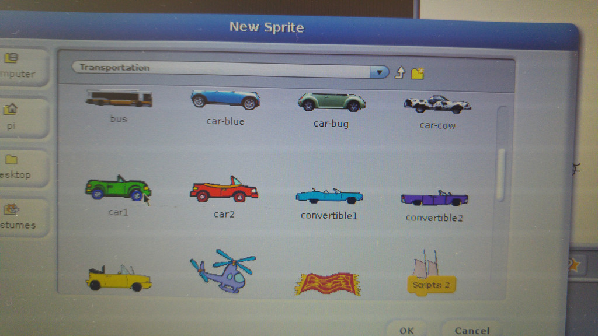
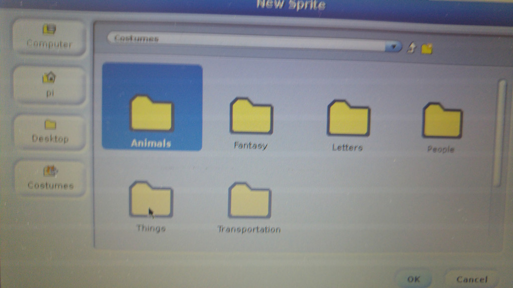
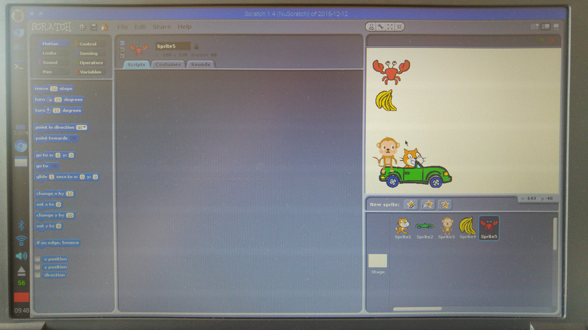

# Using tindex.htmlhe Scratch Stage on screen and unplugged

*1* Select the "shrink" tool.
*2* Click on the sprite to shrink it.
*3* Shrink the sprite to the desired size.
*4* To exit the shrink mode (and return to the normal arrow cursor/pointer) click outside the stage, e.g. in the top grey area.
*5* Click the middle star to select a sprite to add.
*6* To e.g. add a car, choose (double-click) the Transportation category.
*7* To find sprites further down the list, scroll down using the slider to the right.
*8* Select (double-click) the car.
*9* The car can be placed on top of the cat to make it look as if the cat is in the car.
*10* To add another sprite, e.g. a monkey, click the middle star again and press the up arrow button if the sprite selector is still in an other category (we need to go to the Animals category).
*11* Choose the Animals category to find the monkey sprite.
*12* Add it in the same way as you added the car.
*13* Next sprite is the bananas in the Things category.
*14* There you go.
*15* And finally add a crab.
*16* Instead of double-clicking on a sprite to add it, you can also select it with a single-click and click the OK button in the bottom right of the sprite selector dialog window.
*17* Shrink the other sprites to match the scale of the cat, then click and drag the sprites to make the Scratch screen looks like this.
*18* The cat is in a car, the monkey is also in the car and the crab and bananas are in the upper left of the screen.
*19* And this is how it looks like if you arrange the laminated cut-out Scratch elements on the Stage sheet. In this way you can arrange everything and plan your programming code without needing the computer yet: You can call this "unplugged programming" - have fun!
